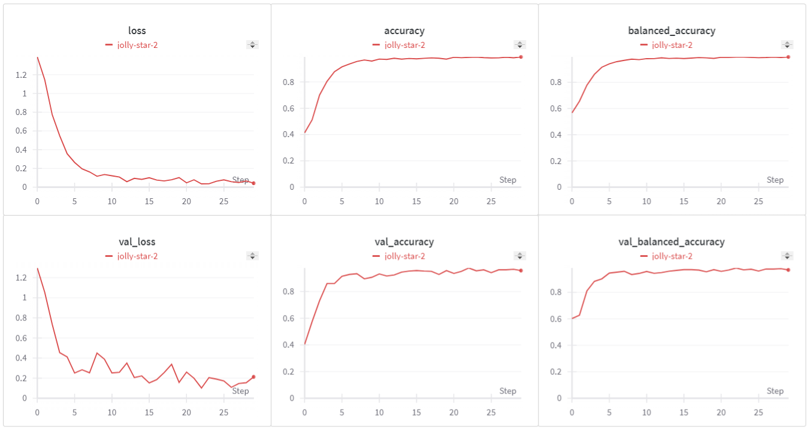
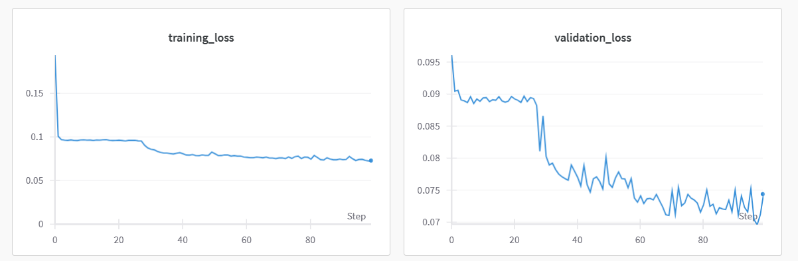

# UBC Ovarian Cancer Subtype Classification and Outlier Detection (UBC-OCEAN)

## Image Classification Model Results

Here are the results of the image classification model developed for the UBC Ovarian Cancer Subtype Classification and Outlier Detection project.

- **Wandb Dashboard**: You can view detailed metrics and visualizations of the training process at this URL: [Wandb Dashboard](https://api.wandb.ai/links/3d-soccer/3gwc5h4j).

- **Model Performance Image**: Below is an image illustrating the model's performance.

## Anomaly Detection Results
